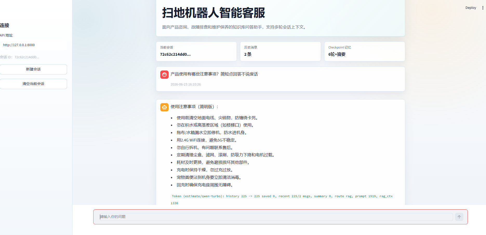
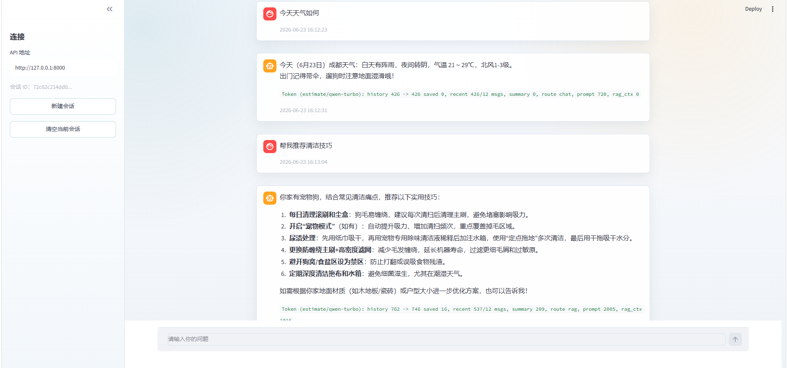
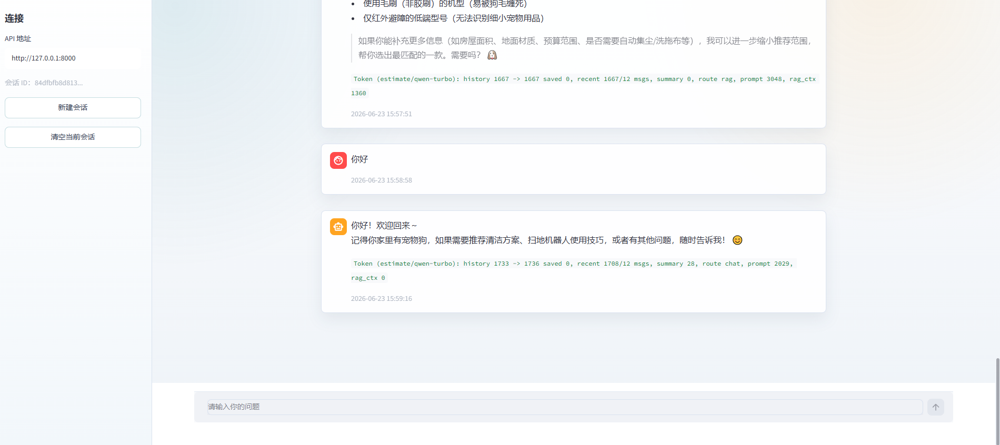

# 基于 FastAPI、Streamlit、LangGraph、PostgreSQL/ParadeDB 的扫地机器人智能客服 RAG Agent

本项目是一个面向扫地机器人、拖地机器人等智能家居产品场景的垂直领域智能客服系统，支持知识库检索、多轮会话记忆、长期用户记忆、Chat/RAG 智能分流，以及可选的高德地图 MCP 工具调用。

系统使用 FastAPI 提供后端问答接口，Streamlit 提供前端聊天页面，LangGraph 负责编排 Agent 工作流，PostgreSQL/ParadeDB 负责知识库检索、会话状态持久化和长期记忆存储。

## 目录

- [功能特性](#功能特性)
- [技术栈](#技术栈)
- [项目截图](#项目截图)
- [技术架构深度解析](#技术架构深度解析)
- [项目结构](#项目结构)
- [快速开始](#快速开始)
- [API 接口](#api-接口)
- [注意事项](#注意事项)

## 功能特性

- 基于本地产品知识库进行扫地机器人相关问答
- 使用 LangGraph 编排上下文准备、意图路由、Chat/RAG 分支、记忆更新等流程
- 使用 PostgreSQL/ParadeDB 存储知识片段，并支持 BM25 + 向量检索的混合召回
- 使用 BGE-M3 embedding 构建语义向量，使用 BGE reranker 对候选文档二次重排
- 使用 PostgreSQL 持久化 LangGraph checkpoint，实现多轮会话状态恢复
- 使用“更早对话摘要 + 最近 6 轮原始上下文”的方式控制短期上下文长度
- 使用 LangGraph Store 保存长期用户记忆，并基于 pgvector/HNSW 进行语义召回
- 自动抽取用户偏好、设备信息、长期问题模式等跨会话记忆
- 支持可选高德地图 MCP 工具，用于位置和天气相关问题
- 提供故障诊断、保养计划、选购推荐等业务工具
- 提供 FastAPI 后端接口和 Streamlit Web 聊天界面

## 技术栈

- Python 3.10+
- FastAPI
- Streamlit
- LangChain / LangGraph
- DashScope / Qwen
- PostgreSQL / ParadeDB
- pgvector / pg_search
- BGE-M3 / FlagEmbedding
- SentenceTransformers
- MCP
- Pydantic

## 项目截图

### 问答示例



### 问答示例



### 回答示例



## 技术架构深度解析

### STEP 1 — 整体架构设计

项目采用“Streamlit 前端 + FastAPI 后端 + LangGraph Agent + PostgreSQL 多能力存储”的轻量化架构。前端负责聊天交互，后端负责接口服务和资源初始化，Agent 层负责编排多轮上下文、意图路由、知识库问答和记忆更新，数据层统一由 PostgreSQL/ParadeDB 承担知识库、会话状态和长期记忆存储。

核心组件分工如下：

| 层级 | 技术 | 作用 |
|---|---|---|
| 前端交互层 | Streamlit | 提供聊天界面、会话 ID 管理和回答展示 |
| API 服务层 | FastAPI | 提供问答、会话清空、知识追加和健康检查接口 |
| Agent 编排层 | LangGraph | 编排上下文准备、LLM 路由、Chat/RAG 分支和记忆维护 |
| 大模型层 | DashScope/Qwen | 负责意图判断、问题改写、回答生成、摘要和长期记忆抽取 |
| 知识库层 | PostgreSQL/ParadeDB | 存储知识片段，支持 BM25 和向量混合检索 |
| 向量检索层 | pgvector + HNSW | 存储知识向量和长期记忆向量，支持语义召回 |
| 重排层 | BGE Reranker | 对候选知识片段进行二次排序，提高上下文质量 |
| 会话记忆层 | LangGraph Checkpoint | 按 `thread_id` 持久化图状态，自动恢复多轮对话 |
| 长期记忆层 | LangGraph Store | 保存用户偏好、设备信息和长期问题模式 |
| 工具层 | MCP / 业务工具 | 支持位置天气、故障诊断、保养计划、选购推荐等能力 |

整体问答流程如下：

```text
用户问题
   |
   v
Streamlit 前端
   |
   v
FastAPI 后端 /chat
   |
   v
LangGraph 从 checkpoint 恢复会话状态
   |
   v
prepare_context: 组装摘要、最近消息、长期记忆
   |
   v
llm_router: 判断走 Chat 还是 RAG
   |\
   | \-- chat_agent: 普通聊天 / 必要时调用 MCP 工具
   |
   \---- rewrite: 改写检索查询
          |
          v
       rag_agent: 知识库检索 + rerank + RAG 回答 / 业务工具调用
   |
   v
extract_long_term_memory: 抽取长期用户记忆
   |
   v
summarize_if_needed: 维护“摘要 + 最近 6 轮”上下文
   |
   v
写入 checkpoint 并返回前端展示
```

### STEP 2 — FastAPI 接口与前端交互

后端使用 FastAPI 对前端提供问答服务，核心接口为：

```http
POST /chat
```

请求体包含用户问题和可选的会话 ID：

```json
{
  "question": "扫地机器人拖地有水渍怎么办？",
  "session_id": "demo-session"
}
```

`session_id` 会作为 LangGraph checkpoint 的 `thread_id` 使用。同一个 `session_id` 下，前端每次只需要发送本轮新问题，后端会自动从 checkpoint 中恢复该会话之前的消息、摘要和状态。

前端使用 Streamlit 实现，负责维护聊天展示、后端地址和会话 ID。用户提交问题后，前端调用 FastAPI 接口，后端完成 Agent 编排、知识库检索和回答生成，再将答案返回给前端。

### STEP 3 — LangGraph Agent 工作流

Agent 的核心实现在 `app/agent.py`。当前图结构如下：

```text
prepare_context
   |
   v
llm_router
   |-- route = chat -> chat_agent -> extract_long_term_memory -> summarize_if_needed -> END
   |
   `-- route = rag  -> rewrite    -> rag_agent  -> extract_long_term_memory -> summarize_if_needed -> END
```

各节点职责如下：

| 节点 | 作用 |
|---|---|
| `prepare_context` | 从 checkpoint 恢复会话状态，加载长期记忆，准备本轮上下文 |
| `llm_router` | 使用 LLM 判断用户问题进入普通 Chat 还是知识库 RAG |
| `rewrite` | 将用户原始问题改写为更适合知识库检索的查询 |
| `chat_agent` | 处理寒暄、普通聊天，以及必要的位置/天气类工具调用 |
| `rag_agent` | 检索知识库、拼接 RAG prompt，并生成产品客服回答 |
| `extract_long_term_memory` | 从本轮对话中抽取值得跨会话保存的用户记忆 |
| `summarize_if_needed` | 保留最近 6 轮原始消息，将更早对话压缩进摘要 |

`AgentState` 中只保留对图执行和 checkpoint 恢复有价值的字段，例如：

```python
class AgentState(TypedDict, total=False):
    messages: Annotated[List[BaseMessage], add_messages]
    summary: str
    question: str
    rewritten_query: str
    route: RouteName
    memory_context: str
```

其中 `messages` 和 `summary` 是短期多轮对话的核心状态；`memory_context` 是本轮从长期记忆 store 中语义召回得到的用户记忆上下文。

### STEP 4 — RAG 知识库构建

项目使用 `data/` 目录中的 TXT/PDF 文档作为原始知识来源，通过脚本写入 PostgreSQL/ParadeDB 知识库。

知识库构建流程如下：

```text
data/ 文档
   |
   v
DocumentLoader 读取 TXT / PDF
   |
   v
MD5 去重
   |
   v
RecursiveCharacterTextSplitter 文本切分
   |
   v
BGE-M3 生成 embedding
   |
   v
写入 PostgreSQL knowledge_chunks 表
   |
   v
创建 pgvector HNSW 索引和 ParadeDB BM25 索引
```

默认知识表字段包括：

| 字段 | 作用 |
|---|---|
| `id` | 知识片段主键 |
| `chunk_uid` | 文档片段唯一 ID |
| `text` | 知识片段原文 |
| `source` | 来源文件或来源标识 |
| `create_time` | 入库时间 |
| `embedding` | BGE-M3 生成的语义向量 |

### STEP 5 — 混合检索与重排机制

项目没有只使用单一向量检索，而是结合 PostgreSQL/ParadeDB 的两路召回能力：

- **向量检索**：基于 BGE-M3 embedding 和 pgvector/HNSW，适合召回语义相近但表达不同的问题。
- **BM25 检索**：基于 ParadeDB `pg_search`，适合召回错误码、型号、配件名等关键词强相关内容。

在线检索流程如下：

```text
用户问题
   |
   v
LLM 判断进入 RAG
   |
   v
rewrite 改写查询
   |
   v
BGE-M3 编码查询向量
   |
   v
PostgreSQL/ParadeDB 向量检索 + BM25 检索
   |
   v
RRF 融合排序
   |
   v
BGE reranker 二次重排
   |
   v
Top-K 文档进入 RAG Prompt
```

默认配置下，系统先召回 `RETRIEVAL_CANDIDATES=10` 条候选，再通过 reranker 返回 `RETRIEVAL_TOP_K=3` 条最相关片段给大模型生成最终回答。

### STEP 6 — 会话记忆与长期记忆

本项目将记忆分为短期会话记忆和长期用户记忆。

短期会话记忆使用 LangGraph checkpoint 保存到 PostgreSQL。每次调用 `/chat` 时，只传入本轮新消息：

```python
config = {"configurable": {"thread_id": session_id}}
```

LangGraph 会根据 `thread_id` 自动恢复该会话的图状态，包括 `messages`、`summary` 等字段。为了控制上下文长度，系统只保留最近 6 轮原始对话，更早的内容会压缩进 `summary`。

长期用户记忆使用 LangGraph Store 保存到 PostgreSQL，并开启 pgvector 语义索引。回答结束后，系统会用结构化输出从本轮对话中抽取值得长期保存的信息，例如：

- 用户偏好：回答风格、清洁模式、水量偏好等
- 用户稳定事实：户型、地面材质、是否养宠物等
- 设备信息：机器人型号、使用年限、常用设置等
- 长期问题模式：反复出现的故障或使用困扰

后续对话开始时，系统会根据当前问题从长期记忆中语义检索相关内容，并放入本轮 prompt，用于个性化回答。

### STEP 7 — MCP 与业务工具调用

项目支持可选的高德地图 MCP 工具，用于处理位置和天气相关问题：

- `maps_ip_location`：根据 IP 获取用户所在城市
- `maps_weather`：根据城市查询天气信息

同时项目内置了几个无副作用业务工具：

- `diagnose_fault`：根据故障现象生成排查建议
- `generate_maintenance_plan`：生成维护保养计划
- `recommend_robot_type`：根据使用场景推荐扫地机器人类型

工具会注入到 Agent 中，由模型根据问题语义决定是否调用。普通产品问答优先走知识库上下文，只有明确涉及位置、天气或本地环境的问题才调用高德 MCP。

### STEP 8 — Streamlit Web 界面

前端使用 Streamlit 实现聊天式交互界面，主要能力包括：

- 输入后端 API 地址
- 设置或复用 `session_id`
- 展示用户问题和助手回答
- 调用后端清空当前会话
- 展示 token 统计信息，观察滑动窗口和摘要带来的上下文压缩效果

## 项目结构

```text
.
|-- app/                         # 后端核心代码
|   |-- __init__.py
|   |-- agent.py                  # LangGraph Agent 编排、路由、记忆和回答逻辑
|   |-- business_tools.py         # 故障诊断、保养计划、选购推荐等业务工具
|   |-- config.py                 # 环境变量与项目配置
|   |-- knowledge_base.py         # PostgreSQL/ParadeDB 知识库构建与检索
|   |-- loaders.py                # TXT / PDF 文档加载
|   |-- main.py                   # FastAPI 应用入口
|   |-- mcp_client.py             # MCP 工具客户端
|   |-- memory_embeddings.py      # 长期记忆向量化适配器
|   |-- postgres_schema.py        # PostgreSQL 表结构和索引初始化
|   `-- token_counter.py          # token 统计
|-- data/                         # 原始知识库文档
|-- frontend/
|   `-- streamlit_app.py          # Streamlit 前端入口
|-- scripts/
|   |-- init_postgres.py          # 初始化 PostgreSQL 数据库和扩展
|   `-- build_knowledge_base.py   # 构建知识库
|-- docker-compose.yml            # PostgreSQL/ParadeDB 容器配置
|-- .env.example                  # 环境变量示例
|-- requirements.txt              # Python 依赖
`-- README.md
```

## 快速开始

### 1. 安装依赖

推荐使用 Python 3.10：

```bash
conda create -n rag python=3.10 -y
conda activate rag
pip install -r requirements.txt
```

### 2. 配置环境变量

复制示例配置：

```bash
cp .env.example .env
```

Windows PowerShell 可以使用：

```powershell
Copy-Item .env.example .env
```

然后修改 `.env`，至少填写：

```env
DASHSCOPE_API_KEY=your_dashscope_api_key
POSTGRES_PASSWORD=1234
```

默认情况下，BGE-M3 embedding 和 BGE reranker 会从 HuggingFace 加载，并缓存到 `HF_HOME`。如果你已经下载了本地模型，可以在 `.env` 中启用：

```env
EMBEDDING_MODEL=./models/bge-m3
RERANKER_MODEL=./models/bge-reranker-v2-m3
```

如果暂时不使用高德地图 MCP，可以设置：

```env
MCP_ENABLED=false
```

### 3. 启动 PostgreSQL/ParadeDB

项目提供了 `docker-compose.yml`，可以直接启动数据库：

```bash
docker compose up -d
```

### 4. 初始化数据库

```bash
python scripts/init_postgres.py
```

该步骤会创建项目数据库，并初始化 `vector`、`pg_search` 等扩展和知识库表结构。

### 5. 构建知识库

首次运行需要将 `data/` 目录下的文档写入知识库：

```bash
python scripts/build_knowledge_base.py
```

如果你之前已经使用同一个 PostgreSQL 数据库构建过知识库，并且 embedding 维度一致，可以跳过这一步。

### 6. 启动后端

```bash
uvicorn app.main:app --host 127.0.0.1 --port 8000 --reload
```

后端默认地址：

```text
http://127.0.0.1:8000
```

健康检查：

```bash
curl http://127.0.0.1:8000/health
```

Windows PowerShell：

```powershell
Invoke-WebRequest http://127.0.0.1:8000/health -UseBasicParsing
```

### 7. 启动前端

另开一个终端：

```bash
conda activate rag
streamlit run frontend/streamlit_app.py
```

浏览器访问：

```text
http://localhost:8501
```

前端中的后端地址建议填写：

```text
http://127.0.0.1:8000
```

## API 接口

后端默认运行在：

```text
http://127.0.0.1:8000
```

常用接口：

- `GET /health`：健康检查
- `POST /chat`：聊天问答接口
- `POST /sessions/{session_id}/clear`：清空指定会话 checkpoint
- `POST /knowledge/documents`：手动追加知识文档

### 聊天问答

```http
POST /chat
Content-Type: application/json
```

请求示例：

```json
{
  "question": "扫地机器人拖地有水渍怎么办？",
  "session_id": "demo-session"
}
```

返回示例：

```json
{
  "session_id": "demo-session",
  "answer": "可以先检查水量档位、拖布湿度和地面材质...",
  "token_report": {
    "last_route": "rag",
    "recent_message_count": 2,
    "recent_message_limit": 12
  }
}
```

